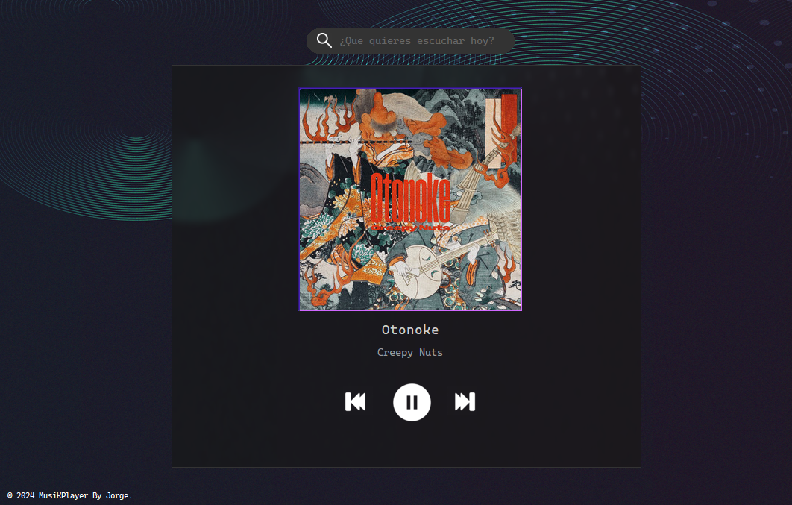

# Reproductor De Musica En Java
Reproductor de musica en java con nodos circulares e interfaz grafica con Jframe.

# Preview
Preview del programa.

## Buscar Canciones
Para buscar canciones se debe ingresar el nombre de la cancion ignorando mayusculas o minusculas, pero escribiendo correctamente el nombre de la cancion.
El repertorio de canciones es limitado  y seleccionadas por el admin jiji.
